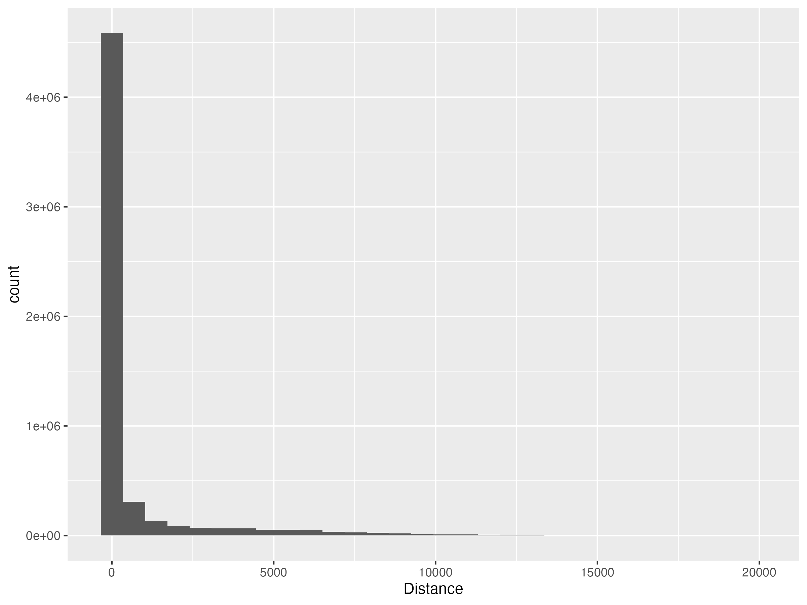

As the world becomes more connected, remote collaboration is becoming more common. However, the recent study rises a question: does remote collaboration really good for the scientific community? The paper published in Nature may provide some disappointing answer. But if we look at the data, we may find some interesting things.

# Fewer breakthrough ideas?

@lin2023 found that remote collaboration fuses fewer breakthrough ideas. They analysed the data of 20,134,803 papers published in 1960-2020. They found that the D score, which is a measure of the breakthrough ideas, is negatively correlated with the distance between collaborators.

Here is the abstract:

> Theories of innovation emphasize the role of social networks and teams as facilitators of breakthrough discoveries. Around the world, scientists and inventors are more plentiful and interconnected today than ever before. However, although there are more people making discoveries, and more ideas that can be reconfigured in new ways, research suggests that new ideas are getting harder to find — contradicting recombinant growth theory. Here we shed light on this apparent puzzle. Analysing 20 million research articles and 4 million patent applications from across the globe over the past half-century, we begin by documenting the rise of remote collaboration across cities, underlining the growing interconnectedness of scientists and inventors globally. We further show that across all fields, periods and team sizes, researchers in these remote teams are consistently less likely to make breakthrough discoveries relative to their on-site counterparts. Creating a dataset that allows us to explore the division of labour in knowledge production within teams and across space, we find that among distributed team members, collaboration centres on late-stage, technical tasks involving more codified knowledge. Yet they are less likely to join forces in conceptual tasks—such as conceiving new ideas and designing research—when knowledge is tacit. We conclude that despite striking improvements in digital technology in recent years, remote teams are less likely to integrate the knowledge of their members to produce new, disruptive ideas.

No need to ask, this paper exert a great influence. According to the [Altmetric](https://nature.altmetric.com/details/156927984), it has been mentioned in 41 news outlets and 2,117 tweeters.

Some people also have some doubts about the result. One must-read comment is from @hawley2023, who carefully pointed out some concerns about the metrics, data, and the method. He also created a schematic to show how D score is calculated. The schematic is very helpful for understanding the paper.

The main concern can be summarized as follows:

1.  Data quality: There are large amounts of data with `NaN`s in the D score column. Most of the variance in D score is driven by 1% of the overall data.
2.  Method issue: The machine learning model used in the paper is not well explained, and the OLS is not appropriate for the data.
3.  Causality concern: The paper didn't discuss the potential confounding factors. For example, the Berkson’s paradox.

Hawley concluded that the paper is interesting but needs more work to be convincing. For this project, I will focus on the missing data and show how the missing data affect the result. Only the data of papers will be used in this project.

# Why the data is missing?

Considering that the missing data accounts for as much as 28% of the total dataset, it is essential to discuss why this data is missing and whether its absence affects the results. The original paper did not mention the missing data. However, as Hawley pointed out, the absence of D scores is likely due to the papers never being cited. The definition of the D score is the proportion of papers solely referencing the focal paper without including its references, subtracted from the proportion of papers that reference both the focal paper and its associated references. If the focal paper is not cited, the former proportion is 0, and the D score is undefined. That is the most likely reason for as much as 28% of the data being missing.

One might argue that non-cited papers could be treated as having a D score of 0. However, given that even the least disruptive papers, which could potentially have a negative D score, are cited at least once, it is not appropriate to consider non-cited papers as more disruptive than non-disruptive papers. Therefore, treating non-cited papers as missing data is the most appropriate approach.

That means as long as the paper is cited, the D score is available. I would like to see whether the missing data is related to the distance between collaborators. Because different from arguable D score, the citation per se is directly and intuitively enough to reflect the quality of the paper.

Thanks to the open data policy, we can analyse the missing data by ourselves.

# Does the likelihood of being cited differ by distance?

For clarity, I will using cited or non-cited to express the data with or without D score.

The raw data used in this project can be found in [here](https://www.dropbox.com/scl/fi/16zx8y4he5l20iaahf3m8/RemoteTeam_DataForMainFigrues.zip?rlkey=c59tog9qecn61fvuzo9o0aczu&e=2&dl=0). Or using the provided link in the paper which is <https://lyl010.github.io>. You need click "Code & Data" and then click "Data" to navigate the data page. Please download the data, which is a file named "raw data.zip", and unzip it in the same directory as this file.

<details>

```{r setup, message = FALSE}
# List of required packages
required_packages <- c("tidyverse","gganimate","cowplot","gifski","png")

# Check and install missing packages
install_if_missing <- function(packages) {
  for (pkg in packages) {
    if (!requireNamespace(pkg, quietly = TRUE)) {
      install.packages(pkg, dependencies = TRUE)
    }
  }
}

install_if_missing(required_packages)

# Load the required packages
library("tidyverse")
library("cowplot")
library("gganimate")
# library("gifski") # for gif, need to install gifski but do not need to load it
# library("png") # for png, need to install png but do not need to load it
```

```{r data input, message = F}
# the file name is the variable name
paperid_year <- read_delim("raw data/Paperid_Year_Discipline_Teamsize_Distance_Dscore.txt",
                           col_names = c("Paperid","Year","Discipline","Teamsize","Distance","Dscore"),
                           delim = "\t")
```

</details>

We will start by breaking down the data by distance. The distance between collaborators ranges from 0 to about 20000 km. The data is divided into six categories: 0 km, 0.1-1000 km, 1000-5000 km, 5000-10000 km, 10000-15000 km, and 15000-20000 km. The cited rate is calculated for each distance category and year. It is defined as the number of missing D scores divided by the total number of papers. The cited rate is then used to calculate the odds ratio of being cited for each distance category relative to the 0 km category. An odds ratio greater than 1 indicates a higher likelihood of being cited than on-site collaboration.

<details>

```{r data wrangling}
# calculate the citation rate
breaks_distacne_fine <- c(-1, 0.1, 1000, 5000, 10000, 15000, 20000)
# the minimum non-zero distance is 0.1725848 km

missing_data_cat <- paperid_year %>%
  select(Distance, Year, Dscore) %>%
  mutate(Distance = cut(Distance, breaks = breaks_distacne_fine,
                        labels = c("0", "0.1-1000", "1000-5000", "5000-10000", "10000-15000", "15000-20000"))) %>%
  group_by(Distance, Year) %>%
  summarise(N = n(), n = sum(is.na(Dscore)), .groups = "drop") %>%
  mutate(citation_rate = 1 - n/N) # citation rate = 1 - missing rate

odds_ratio <- missing_data_cat %>%
  select(Distance, Year, citation_rate) %>%
  pivot_wider(names_from = Distance, values_from = citation_rate) %>% 
  mutate(across(`0.1-1000`:`15000-20000`, ~./`0`)) %>% 
  # odds ratio = citation rate of distance / citation rate of 0 km 
  select(-`0`) %>%
  pivot_longer(cols = 2:6, names_to = "Distance", values_to = "odd_ratio") %>% 
  mutate(Internet_Age = ifelse(Year < 1990, "Before", "After")) 
  # the establishment of Postmodern Culture in 1990 as the first online-only journal

# reorder the distance
custom_order <- c("0.1-1000", "1000-5000", "5000-10000", "10000-15000", "15000-20000")
odds_ratio$Distance <- factor(odds_ratio$Distance, levels = custom_order)
```

```{r checks incorporated, include=FALSE}
odds_ratio %>%
  select(odd_ratio) %>%
  reframe(
    range(.),  # check the range of odds ratio
    sum(is.na(.)), # check if there is any NA
    sum(. < 0.8) # check the number of odds ratio lower than 0.8
  )
# although the range is 0.72-1.25, the y axis in the original paper is 0.8-1.3 as the outlier just appears two times
```

```{r animate, warning=FALSE}
anim_missing <- odds_ratio %>% 
  ggplot(aes(x = Distance, y = odd_ratio, fill = Internet_Age)) +
  geom_bar(stat = "identity") +
  transition_time(Year) +
  theme_cowplot() + 
  ease_aes('linear') +
  geom_abline(intercept = 1, slope = 0, linetype = "dashed") +
  labs(title = "Relative citation rate of academic papers published in {round(frame_time)}",
       y = "Relative probability of being cited (Odds ratio)",
       x = "Distance between collaborators (km)",
       caption = "Odds ratio higher than 1 means higher likelihood of being citated than on-site collaboration",
       fill = "1990 (The first online-only journal established)") +
  labs(subtitle = "Remote versus on-site collaboration by distance between collaborators") +
  theme(axis.text.x = element_text(size = 10),
        legend.position = c(0.05, 0.9)) +
  coord_cartesian(ylim = c(0.8, 1.3)) # the y axis in original paper is 0.8-1.1
```

```{r saving gif, include=FALSE}
# save the gif
saving_path <- "plots/"
anim_save("relative_citation_rate.gif", animation = anim_missing, ani.width = 800, ani.height = 600,
          path = saving_path)
```

</details>


The animation depicts two tendencies. First, the odds ratio of being cited is generally higher for remote collaboration than for on-site collaboration after 1990. Second, the variance in the odds ratio is higher for longer distances.

Regarding the first tendency, the most likely explanation is that the internet has made it easier for researchers to collaborate remotely. I chose 1990 as the cut-off year because it marks the establishment of the first online-only journal, Postmodern Culture. For data after 2010, the odds ratio is more stable and higher than before. There may be two reasons for this. First, the internet has become more accessible and reliable. Second, the explosion of papers, including non-cited papers, has made the data more robust. Even though the citation rate for papers published after 2015 is lower due to the lack of time for being cited, the higher sample size makes the result as reliable as before. Refer to the sections 'Distribution of Missing Data' and 'Explosion of Papers' for more information.

Regarding the second tendency, the variance in the odds ratio is higher for longer distances. This may be due to the smaller sample size for longer distances, leading to a higher variance in the odds ratio. In this case, it implies that the higher likelihood of being cited for remote collaboration in the recent 10 years is more stable and accurate.

# Why we should care about the non-cited paper?

An intuitive way to treat the non-cited paper is to ignore it as other scholars do. However, that is not the case when you are looking for the consequence of some factors on the academic out put. When people conclude that the remote collaboration lead to less breakthrough ideas, they means or at least imply a general effect of the remote collaboration. For a random paper, there is a fair chance that it is non-cited, as the data has shown: 28%. If you conclusion is for the cited paper, you should mention it. Then people will automatically think about the potential bias of the non-cited paper. If you ignore the non-cited paper, and did not mention it, people may think that you have already considered it. Unfortunately, that is not the case for this influential paper.

This automatic ignore not only mislead the reader without critical thinking, but also may block the potential suspect from the reader who has critical thinking.

# After all, shall I choose remote collaboration?

The short answer is to maintain the preference you had before.

The original paper found that on-site collaboration has about a 1.08 relative probability of disruption compared to remote collaboration without time effect. Our analysis shows about higher than 1.1 relative probability of being cited compared to on-site collaboration after 2010. However, the trade-off is not simply subtractive.

I believe that the effect size of remote collaboration on academic output is much less significant than individual differences. In daily decisions, decision-makers have much more information about their situation than data scientists. What I can infer from the data is that citable ideas may be more likely to attract collaboration. Considering the costs of remote collaboration, bad ideas may not be able to proceed. Therefore, for people who have an idea and are seeking collaboration, individual preference may be the most important factor.

The original paper acknowledges that citations increase as the distance between collaborators increases. However, they explain this as evidence to show that their measure of disruption is independent of citation. This might make sense for sufficiently cited papers. However, for non-cited papers, the basic logic remains that the breakthrough of cited papers cannot be lower than that of non-cited papers.

This project shared a lots of limitations with the original paper. Considering they didn't share process free data, we cannot include as more potential factors as the original paper could. However, by considering the missing data, we provide a more comprehensive view of the data.

Additionally, I'd like to highlight that our dataset consists of 20 million data points. The extensive size of the dataset raises an important concern known as Lindley's paradox. In brief, with a large sample size, there's an increased likelihood that the significance of results may support the null hypothesis. For further details on this concept, I recommend reviewing [this material](https://lakens.github.io/statistical_inferences/01-pvalue.html#sec-lindley). Given that the original paper used an OLS regression, it's crucial to interpret the results with caution.

# Conclusion and Significance

1.  By looking at the ignored data, we found an opposite result to the original paper using the same data set. This finding indicates the importance of describing the analysis process in detail and sharing the data.

2.  Instead of supposing selection bias, we confirmed that the missing data is related to the distance between collaborators. This finding indicates that it is true that on-site collaboration yields more uncitable papers, and this ignored result may affect the result of the original paper.

3.  Don't be afraid of remote collaboration. The data shows strong evidence that the remote collaboration is good for the scientific community, as the original paper shows that it is bad, and we did find a time effect for getting a better result.

# Extended analysis

## Distribution of missing data

The first histogram illustrates the distribution of missing data across the distance between collaborators. It shows that missing data is more frequent when the distance between collaborators is less than 1000 km. The second histogram depicts the distribution of missing data over time, indicating a higher number of occurrences in recent years. Both trends are attributed to the amount of data in each corresponding category.

<details>

```{r missing data plot}
missing_data <- paperid_year %>%
  filter(is.na(Dscore))

di_hist_miss <- ggplot(missing_data, aes(x = Distance)) +
  geom_histogram()

year_hist_miss <- ggplot(missing_data, aes(x = Year)) +
  geom_histogram()
```

</details>




## Distribution of distance among remote collaboration

<details>

```{r distance with remote collaboration}
di_stack <- paperid_year %>% 
  filter(Distance > 0) %>%
  mutate(cited = ifelse(is.na(Dscore), "non-cited", "cited")) %>%
  ggplot(aes(x = Distance, fill = cited)) + 
  geom_histogram(position = "stack") + 
  labs(title = "Distribution of distance among remote collaboration (stack)")
```

</details>


The histogram shows the distribution of distance for all data points with a distance greater than 0.

As the original paper mentioned, "among remote teams, 22% of the sample have a collaboration distance of 0–200 km, and 11%, 7% and 60% of the papers have a collaboration distance of 200–400 km, 400–600 km and more than 600 km, respectively."

<details>

```{r data check}
breaks_distacne_fine_200 <- c(-1, 200, 400, 600, 20000)
remote_data_cat <- paperid_year %>%
  select(Distance, Year, Dscore) %>%
  filter(Distance > 0) %>%
  mutate(Distance = cut(Distance, breaks = breaks_distacne_fine_200,
                        labels = c("0.1-200", "200-400", "400-600", "600-20000")))
# show the proportion of each distance
table(remote_data_cat$Distance) / nrow(remote_data_cat)
# 0.22475503 0.10839041 0.07092556 0.59592900 
```

</details>

## Heatmap of citation rates

<details>

```{r heatmap}
breaks_year <- seq(from = 1960, to = 2020, by = 5)
missing_data_cat_5year <- paperid_year %>%
  select(Distance, Year, Dscore) %>%
  mutate(Distance = cut(Distance, breaks = breaks_distacne_fine, 
                        labels = c("0", "0.1-1000", "1000-5000", "5000-10000", "10000-15000", "15000-20000")),
         Year = cut(Year, breaks = breaks_year, 
                    labels = c("1960-", "1965-", "1970-", "1975-", "1980-", "1985-", "1990-", "1995-", 
                               "2000-", "2005-", "2010-", "2015-2020"),
                    include.lowest = T, right = T)) %>%
  group_by(Distance, Year) %>%
  summarise(N = n(), n = sum(is.na(Dscore)), .groups = "drop") %>%
  mutate(citation_rate = 1 - n/N)

# y_d: Year vs Distance
y_d_missing <- missing_data_cat_5year %>% 
  ggplot(aes(x = Distance, y = Year, fill = citation_rate,
             label = round(citation_rate, 2))) +
  geom_tile() +
  geom_text(color = "black") +  # Add text labels
  scale_fill_gradient(low = "white", high = "red") +
  labs(title = "Heatmap of citation rate", fill = "Citation Rate") +
  theme_cowplot() +
  theme(axis.text.x = element_text(angle = 20, hjust = 1))
```

</details>


We can clearly see that the red squares over the 2000 to 2015 and the remote collaboration. This indicates that the except the paper published near 2020 (data collection time), the papers with remote collaboration are more likely to be cited since 2000.

## Difference between disciplines

<details>

```{r disciplines}
# we use the same way to classify the discipline as the original paper
science_and_engineering = c("geology","medicine","mathematics","physics","materials science",
                            "biology","chemistry","engineering","computer science","geography",
                            "environmental science")
social_sciences <- c("political science","business","economics","psychology","sociology")
art_and_humanity <- c("history","art","philosophy")
# the definition above can be found in the code of the original paper

df <- bind_rows(
  data.frame(Discipline = science_and_engineering, Fields = "Science and Engineering"),
  data.frame(Discipline = social_sciences, Fields = "Social Sciences"),
  data.frame(Discipline = art_and_humanity, Fields = "Art and Humanity")
)

paperid_year_fields <- left_join(paperid_year, df, by = "Discipline")

# check incorporated
paperid_year_fields %>% 
  is.na() %>%
  sum() # check if there is any NA
```

```{r discipline}
citation_rate_discipline <- paperid_year_fields %>%
  select(Distance, Year, Dscore, Fields) %>%
  mutate(Collaboration = ifelse(Distance > 0, "remote", "on-site")) %>%
  group_by(Collaboration, Year, Fields) %>%
  summarise(N = n(), n = sum(is.na(Dscore)), .groups = "drop") %>%
  mutate(citation_rate = 1 - n/N) 

# Year vs citation rate by discipline
y_c_d <- citation_rate_discipline %>% 
  filter(Fields != "NA") %>%
  ggplot(aes(x = Year, y = citation_rate, color = Fields, linetype = Collaboration)) +
  geom_line() +
  labs(title = "Citation rate by discipline",
       y = "Citation Rate", x = "Year",
       caption = "The original paper classified the disciplines into three categories") +
  theme_cowplot()
```

</details>


The line plot shows the citation rate by discipline over time. The three disciplines are science and engineering, social sciences, and art and humanity. The citation rate is higher for social sciences than for science and engineering and art and humanity. We can also see that the art and humanity was benefited most from remote collaboration. This might be because the potential ceiling effect of the science and engineering and the social sciences. Let's see the odds ratio of being cited for each discipline.

<details>

```{r odds ratio}
odds_ratio_discipline <- citation_rate_discipline %>%
  select(Fields, Year, citation_rate, Collaboration) %>%
  pivot_wider(names_from = Collaboration, values_from = citation_rate) %>% 
  filter(Fields != "NA") %>%
  transmute(Fields, Year, odd_ratio = remote/`on-site`) 

# Year vs odds ratio by discipline
y_o_d <- odds_ratio_discipline %>% 
  ggplot(aes(x = Year, y = odd_ratio, color = Fields)) +
  geom_line() +
  labs(title = "Odds ratio by discipline",
       y = "Odds Ratio", x = "Year",
       caption = "Odds ratio higher than 1 means higher likelihood \n of being citated than on-site collaboration") +
  theme_cowplot() +
  geom_abline(intercept = 1, slope = 0, linetype = "dashed") +
  geom_vline(xintercept = 1990, linetype = "dashed")
```

</details>


Besides the extreme high odds ratio of art and humanity, the odds ratio of social sciences and science and engineering are steadily higher than 1 since about 1990. This indicates that the remote collaboration is more likely to be cited than the on-site collaboration in recent 30 years.

Although the oscillating odds ratio of art and humanities has a strong appeal for attributing special reasons, considering the high variance of citation rates in this discipline, it is more likely that the result is due to random fluctuation.

## Explosion of papers

As I mentioned before, the the odds ratio is much more stable after 2000. This may be due to the explosion of papers. Let's see the number of papers published each year.

<details>

```{r explosion}
anim_n <- missing_data_cat %>% 
  transmute(Year, Distance, Yes = N - n, No = n) %>%
  pivot_longer(cols = 3:4, names_to = "Cited", values_to = "Numbers") %>%
  ggplot(aes(x = Distance, y = Numbers, fill = Cited)) +
  geom_bar(stat = "identity",
           position = "stack") +
  transition_time(Year) +
  theme_cowplot() + 
  ease_aes('linear') +
  labs(title = "Number of papers in data set in {round(frame_time)}",
       y = "Number", x = "Distance between collaborators (km)") +
  theme(axis.text.x = element_text(size = 10)) 
```

</details>


The animation shows that the number of papers has increased dramatically since 2000 and the increase is more significant for on-site collaboration.

```{r saving plot, include=FALSE}
# save the gif
anim_save("number_of_papers.gif", animation = anim_n, ani.width = 800, ani.height = 600,
          path = saving_path)
# discipline
ggsave("discipline_line.png", y_c_d, width = 8, height = 6, dpi = 300, path = saving_path)
ggsave("discipline_odds_ratio_line.png", y_o_d, width = 8, height = 6, dpi = 300, path = saving_path)
# heatmap
ggsave("citation_heatmap.png", y_d_missing, width = 8, height = 6, dpi = 300, path = saving_path)
# missing data
ggsave("missing_data_distance.png", di_hist_miss, width = 8, height = 6, dpi = 300, path = saving_path)
ggsave("missing_data_year.png", year_hist_miss, width = 8, height = 6, dpi = 300, path = saving_path)
# distance of remote collaboration
ggsave("distance_of_remote_collaboration_stack.png", di_stack, width = 8, height = 6, dpi = 300, path = saving_path)
```

# Possible Extensions

As mentioned before, the breakthrough of cited papers cannot be lower than that of non-cited papers (given the same and sufficient existing time). Considering that we have already found that papers with on-site collaboration have a higher proportion of non-cited papers, we can assign a D score of -1 to the non-cited papers and re-analyse the data. Although this approach still somewhat overestimates the disruptiveness of non-cited papers, given the fact that only 1% of data has lower D score than -0.2, it may be sufficient to change the result.

One may argue that the opposite of disruption is "development" rather than "non-disruption", as the original paper mentioned. However, considering the extreme proportion of non-cited papers, even if we assign a D score of 0 to the non-cited papers, the result may still be changed.

# Appendix

## Potential issues of gganimate

If you have been using R and RStudio for a while but haven't used gganimate, you may find it a little tricky to install gganimate. The issue is that you cannot use `install.packages("gganimate")` directly in RStudio because it requires updating some packages that underpin RStudio. You may need to use the terminal to update these packages first. For macOS and Linux, you can use the following command:

``` bash
r # open R in the terminal
update.packages(ask = FALSE) # update all packages, without asking
```

Please refer to [this](https://forum.posit.co/t/issue-with-installed-packages-endless-loop-updating-loaded-packages-one-or-more-of-the-packages-that-will-be-updated-by-installation-are-currently-loaded-restarting-r-prior-to-updating-these-packages-is-strongly-recommended/9458).

You may also find that the gif is not working in the pdf. This is because the pdf does not support gif. You cannot using anim_save to save the gif either when knitting to pdf. You have to comment out the anim_save if you want to knit to pdf.

## Repository

Code and figures can be found [here](https://github.com/Lingyu-Meng/PSY6422_coursework_project.git).

# References
